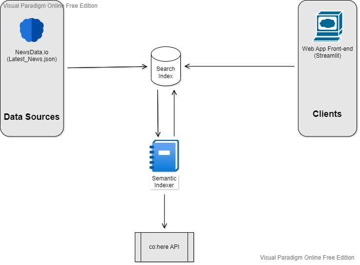

# https://lablab.ai/event/semantic-search-hackathon
---
## Team : Embeddings

---

| Team      | [Embeddings](https://lablab.ai/event/semantic-search-hackathon/embeddings) |
| ----------- | ----------- |
| 0. Team Leader      | [Ramesh Kumar](https://lablab.ai/u/@rameshkjes)       |
| 1. Member   | [Nikolas Stavrou](https://lablab.ai/u/@nikolas_stavrou995)        |
| 2. Member   | [Eric Brichetto](https://lablab.ai/u/@eric_brichetto537)        |
| 3. Member   | [Aman Yadav](https://lablab.ai/u/@automatlog)        |
| 4. Member   | [Tobias Anyigor](https://lablab.ai/u/@Tobby_ai)        |
| 5. Member   | [Bouhouch Chamseddine](https://lablab.ai/u/@bouhouch_chamseddine252)        |
---

```py
Project : News Monitoring System
```
---
## Project Value Proposition
This project is designed as a minimal implementation of a news monitoring solution. In particular, it is intended to provide the core functionality of brand monitoring, a subset of news monitoring use cases. Techopedia defines this technology as "a business analytics process concerned with monitoring various channels on the web or media in order to gain insight about the company, its products, brand, and anything explicitly connected to the business... Brand monitoring deals with regularly and strategically investigating media and online resources in order to discover and eventually react to the different sentiments that you and your competitor's brand are experiencing."[[1]](https://www.techopedia.com/definition/30310/brand-monitoring)

Using a multilingual dataset of news articles published worldwide, combined with a search index enriched by the Cohere API, our project submission provides a simple user interface for performing semantic search over these articles for mentions of a company or brand name. 

---
## Combining News Monitoring with Semantic Search 
Why apply semantic search techniques to a news monitoring product? Why is a mere lexical or keyword search not sufficient for this use case? We refer to the excellent explanation by Repustate[[2]](https://www.repustate.com/blog/news-media-monitoring-with-semantic-ai/): 

> The reason is that even though keyword searches can be helpful when you want to find specific information in vast amounts of data, it has serious limitations when it comes to scouring through millions of news and media pieces to gain insightful information. News sentiment analysis can give you nuggets of information from the vast sea of data that you would probably be unaware of, had it not been for an AI-model’s deep search and neural network finding that particular combination of aspect-co occurrence.
>
> Unlike a semantic algorithm, when you use keyword searches for news monitoring services, search engines will help you do this by identifying keywords wherever they appear in the content. What they don’t do is take into account the specific meaning of a word or the context in which it appears. This is problematic in news media monitoring because a single word may have many different meanings.
> 
> The inevitable result is that you are presented with irrelevant information relating to your search. Here, another major drawback of keyword searches is that they often miss relevant information because a query didn’t contain the keyword used to do the search. Stemming from this, keyword searches often also produce a large number of results that all contain the keywords in the query but lack any causal connection between the words which ultimately makes the results unusable if not irrelevant.


[1] https://www.techopedia.com/definition/30310/brand-monitoring

[2] https://www.repustate.com/blog/news-media-monitoring-with-semantic-ai/

---
## Basic Project Architecture


